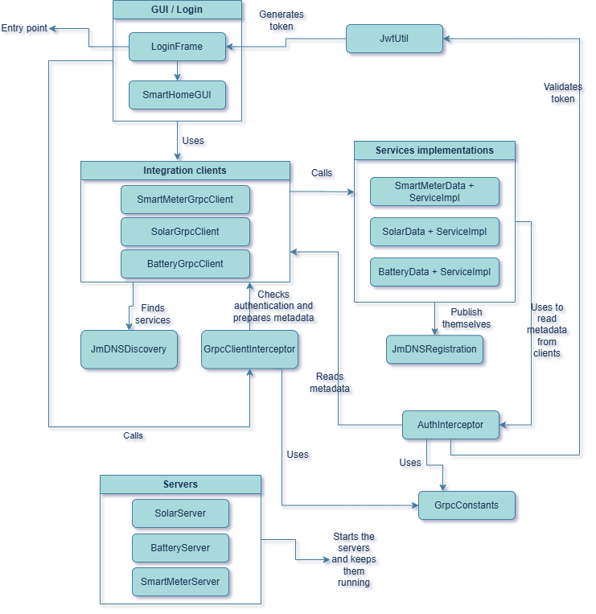

[README.md](https://github.com/user-attachments/files/30638110/README.md)
# Smart Home Energy Management System

A distributed Java application built for the *Distributed Systems* module (Higher Diploma in Science in Computing, National College of Ireland). It simulates a smart home that supports **UN Sustainable Development Goal 7 – Affordable and Clean Energy**, by monitoring solar production, battery storage and household energy consumption through a set of independent services that discover and call each other over the network.

## Overview

Instead of one single program, the system is made of three independent Java services, each representing a real device or role you would find in a smart home:

- **Solar Panel Service** – reports how much energy a solar panel is currently producing.
- **Battery Storage Service** – tracks the charge level and mode of the home battery, and asks the Solar Service for production data when it needs to refresh its own state.
- **Smart Meter Service** – acts as the house's intelligent controller: it asks both the Solar and Battery services for data, builds an energy report, and also collects consumption readings from appliances.

A single desktop client, **SmartHomeGUI** (behind a **LoginFrame** login screen), is used to demonstrate the whole system. It discovers the three services automatically on the network and gives the user one tab per service to view data, send commands and watch live updates.

## Architecture

Each service is a standalone gRPC server with its own port, its own domain model and its own `.proto` contract. They never share code or memory — the only way they talk to each other is through gRPC. Two mechanisms tie everything together:

- **jmDNS** – every service publishes itself on the network when it starts, and any other service or the GUI can find it by name instead of relying on a fixed IP address and port.
- **Integration clients** (`SolarGrpcClient`, `BatteryGrpcClient`, `SmartMeterGrpcClient`) – small classes that hide the details of finding a service and calling it. Both the GUI and the other services reuse these clients, so discovery and communication logic is never duplicated.

Because the Battery Service needs data from the Solar Service, and the Smart Meter Service needs data from both, a single action started in the GUI can trigger a chain of gRPC calls across two or three services before a result comes back (cascading calls).

The system followed a layered design throughout: a plain domain object holds a service's internal state (`SolarData`, `BatteryData`, `SmartMeterData`), a `*ServiceImpl` class implements the gRPC contract and converts between the domain object and the protobuf messages, and a `*Server` class only starts the gRPC server, registers the service and publishes it through jmDNS.

## Services and RPCs

All four gRPC communication styles required by the assignment are used across the three services:

| Service | RPC | Style | Request | Response |
|---|---|---|---|---|
| Solar Panel | `GetCurrentProduction` | Unary | `panelId` | `ProductionInfo` |
| Solar Panel | `MonitorProduction` | Server streaming | `panelId` | stream `ProductionInfo` |
| Battery Storage | `GetBatteryStatus` | Unary | `batteryId` | `BatteryStatusInfo` |
| Battery Storage | `MonitorBatteryStatus` | Bidirectional streaming | stream (`batteryId`, `command`, `mode`) | stream (`BatteryStatusInfo` + ETA + message) |
| Smart Meter | `GenerateEnergyReport` | Server streaming | `houseId` | stream `ReportEntry` |
| Smart Meter | `UploadConsumptionReadings` | Client streaming | stream `ConsumptionReading` | `ConsumptionSummary` |

Shared/reusable messages include `ProductionInfo`, `BatteryStatusInfo`, `ReportEntry`, `ConsumptionReading` and `ConsumptionSummary`, plus the enums `ChargingStatus`, `BatteryMode` and `BatteryCommand`.

## Naming service (jmDNS)

- `JmDNSRegistration` – used by each server right after it starts, to publish itself under the shared service type `_grpc._tcp.local.`, and to release the registration cleanly on shutdown.
- `JmDNSDiscovery` – used by every integration client before its first call, to look up a service's host and port (five-second timeout). Discovery is done lazily, on first use, so that a service that depends on another one can still start even if that other service isn't up yet.

## Security and advanced gRPC features

- **JWT authentication** – a `LoginFrame` window asks for a username and password (demo credentials: `admin` / `admin123`). Once accepted, `JwtUtil` issues a signed HS256 token (JJWT, 30-minute expiry) that `SmartHomeGUI` distributes to all three integration clients.
- **Metadata** – `GrpcClientInterceptor` automatically attaches a client name, a request ID and the JWT to every outgoing call; `AuthInterceptor` reads and validates that metadata on the server side before a call reaches the service implementation, rejecting requests with `UNAUTHENTICATED` if the token is missing or invalid. Shared keys live in `GrpcConstants`.
- **Deadlines** – integration clients can apply `withDeadlineAfter(...)` to a call, so gRPC automatically cancels a request and returns `DEADLINE_EXCEEDED` if a server takes too long to respond.
- **Remote error handling** – every `*ServiceImpl` validates its input and responds with proper gRPC status codes (`INVALID_ARGUMENT`, `INTERNAL`, `CANCELLED`, `UNAVAILABLE`) instead of leaking raw Java exceptions. When one service calls another, the original `StatusRuntimeException` is passed through unchanged so the real cause of a failure reaches the GUI.

## Client GUI

`SmartHomeGUI` is a Java Swing application with one tab per service:

- **Solar Panel tab** – unary production lookup plus a toggle to start/stop live monitoring (server streaming), with client-side cancellation.
- **Battery Storage tab** – unary status lookup plus a toggle for bidirectional monitoring, with mode-switch buttons (Normal / Eco / Performance) that send commands through the already-open stream.
- **Smart Meter tab** – server-streaming energy report generation, plus a local "add reading" step and a client-streaming upload of consumption readings that returns a single summary.

The GUI never talks to gRPC directly — every call goes through the matching integration client, keeping presentation, communication and business logic separate.

## Tech stack

- Java
- Maven
- gRPC and Protocol Buffers
- jmDNS
- JJWT 0.11.5 (JSON Web Tokens)
- Java Swing (GUI)

## Project structure (packages)

- `com.smarthome.solar`, `com.smarthome.battery`, `com.smarthome.smartmeter` – generated protobuf/gRPC code.
- `com.smarthome.server.solar`, `com.smarthome.server.battery`, `com.smarthome.server.smartmeter` – manual service implementations, servers and domain objects.
- `advancedgrpc` – `GrpcConstants`, `GrpcClientInterceptor`, `AuthInterceptor`, `JwtUtil`.
- GUI package – `LoginFrame`, `SmartHomeGUI`.

Default ports: Solar `50051`, Battery `50052`, Smart Meter `50053`.

## Running the project

1. Build the project with Maven (`mvn clean install`).
2. Start the three servers (any order — jmDNS discovery and lazy client connections handle startup timing): Solar Server, Battery Server, Smart Meter Server.
3. Run `LoginFrame`, log in with `admin` / `admin123`, and use the Solar, Battery and Smart Meter tabs in `SmartHomeGUI` to exercise each RPC.

## Repository

Full source code and commit history:(https://github.com/adriana-d28/SmartHomeEnergySystem).

## Author

Adriana Souza Dinelly – Higher Diploma in Science in Computing, National College of Ireland.
